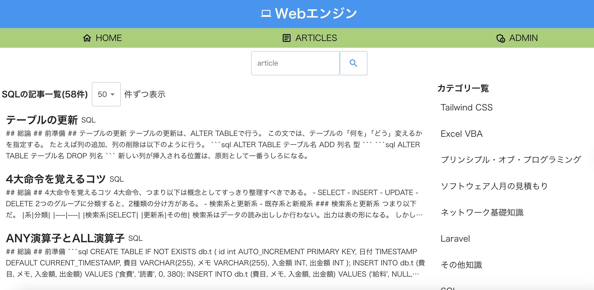
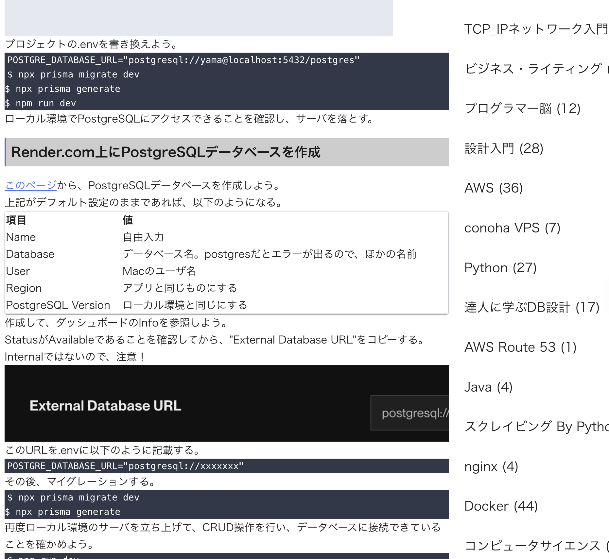

## このアプリについて

自作ブログアプリのフロントエンドです。学習した内容をブログ風に閲覧できるようにしました。

デプロイ先は以下

https://react-sentence-frontend.vercel.app/

## 仕様

ローカル環境のメモアプリである"Joplin"に記載した内容をオンライン上でブログ風に見れるようにしました。
Joplin のマークダウン形式ファイル(.md)をアップロードすると、内容や画像が保存されます。

## 技術スタック

-   React
-   TypeScript
-   Tailwind CSS
-   AWS Fargate(初期デプロイ時に使用、現在は Vercel で運用中)

    -   Docker, nginx, AWS Route 53, AWS Budgets, AWS CloudWatch も設定

    ※以前は AWS Fargate でデプロイしていましたが、
    個人利用としては料金が高く、Vercel に移行しました。

## 工夫した点

-   .md(マークダウン)ファイルをフォルダごとアップロードできるようにした。フロントエンドでは各ファイルの親フォルダ名をカテゴリー名として取得し、内容とカテゴリー名をバックエンドに渡すようにした。
-   エクスポート後の.md ファイルには画像が保存されておらず、画像パスのみが記載される。Joplin では\_resource フォルダに全画像が保存されるため、これをバックエンドに受け渡し、AWS S3 に保存されるようにした。このとき、元の.md ファイルが示す画像パスを、AWS S3 のパスに変換して保存するようにした。
-   .md ファイルはバックエンドでマークダウン記法のまま保存し、フロントエンドでは react-markdown や react-syntax-highlighter を使用して HTML に変換して表示するようにした。
-   エイリアス(@/)を使用するため、react-app-rewired を使用した。
-   美麗なロゴやアイコンを使用するため、Material-UI(MUI) を使用した。
-   状態管理には Redux ではなく React Query を使用した。今回のようにサーバーからデータを取得し、それを表示する用途では、React Query のほうがシンプルかつ最適だと感じた。
-   テキストのサイズやフォントを一括で管理できるよう、Tailwind CSS を使用した。
-   当初は AWS Fargate を使ってインフラ構築を行っていた。理由は、Docker ベースでコンテナ運用が可能で、スケーラブルな構成がより実務的であるためである。タスク定義、CloudWatch ログの設定、AWS Route 53 の設定、nginx の設定も行ったものの、少ないアクセスでもコストが 1 日 1,000 円以上となるケースがあり、個人開発としては持続可能でないと判断。現在は Vercel で運用中。

## デモ画像

記事一覧。クリックすると記事詳細画面に移行する。



表、リンク、画像、コードも正しく表示されている。



## 以下、開発者向けメモ

### ローカル環境での起動

```
npm run start
```
